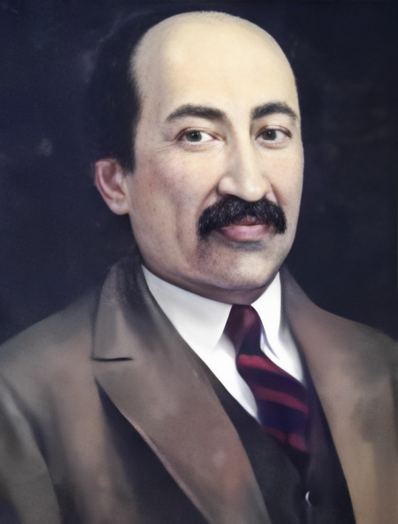

# fitrat



An NLP library for Uzbek. It includes morphological analysis, transliterators, language identifiers, tokenizers and many more.

It is named after historian and linguist Abdurauf Fitrat, who was one of the creators of Modern Uzbek as well as the first Uzbek professor.

<br />

## Usage

### Installation

```shell
pip install fitrat
```

### Language Identification

We can recognize Uzbek text, both Latin or Cyrillic. Additionally, we can recognize other major languages, such as Russian, English, Arabic and etc.

```python
from fitrat import LanguageDetector

lang_detector = LanguageDetector()

print(lang_detector.is_uzbek("bu o'zbekchada yozilgan matn"))
# True

print(lang_detector.is_uzbek("бу нотугри йозилган булсаям, лекин узбекча матн"))
# True

print(lang_detector.is_uzbek("Текст на русском языке"))
# False
```

### Transliteration

Currently we disabled because hfst-dev doesn't work for Python 3.8 and newer.

We used hfst library for creating transliterators. This library provides finite-state transducers, a finite-state machines that come very handy for efficient mapping one text to another.

While Cyrillic-Latin conversion is rule-based and simple, the converse is not true. We included special pre-compiled exceptions transducer for Latin-Cyrillic that handles all (to our knowledge) exceptions. We'll continue working on improving on our exceptions list.

```python
from fitrat import Transliterator, WritingType

t = Transliterator(to=WritingType.LAT)
result = t.convert("Кеча циркка бордим.")
print(result)
# Kecha sirkka bordim.

t2 =Transliterator(to=WritingType.CYR)
result = t2.convert("Kecha sirkka bordim.")
print(result)
# Кеча циркка бордим.
```

## Tokenization

```python
from fitrat import word_tokenize

s = "Bugun o'zbekchada gapirishga qaror qildim!"
print(word_tokenize(s))
# ['Bugun', "o'zbekchada", 'gapirishga', 'qaror', 'qildim', '!']
```

## Authors

- Mukhammadsaid Mamasaidov
- Jasur Yusupov
